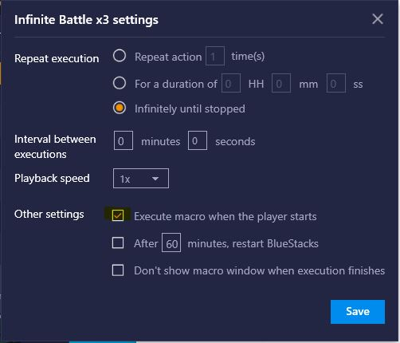

# BlueStacksAutoRestarter

How to Run
  1. Python must be installed 
  https://www.python.org/downloads/
  
  2. Create the macro you want to run
    Inside that specific macro setting, make sure "Execute macro when the player starts" is checked
	

    
  3. In BlueStacks settings, make sure "Display" -> "Resolution" is set at "portrait (Phone mode)"

  
  4. Double click on bluestacks.py to execute
  
  5. (Optional) Change the value in config time=X (X=time in minutes between restarts, default is time=40)
